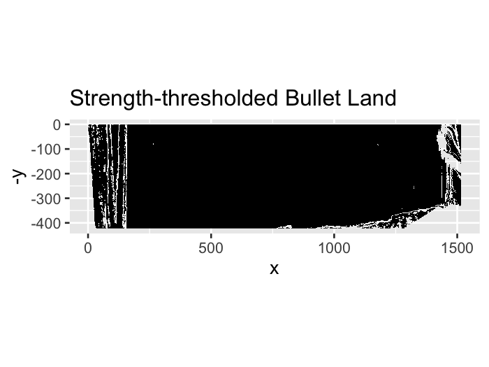
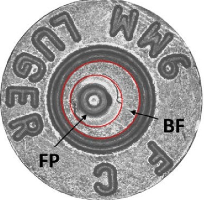
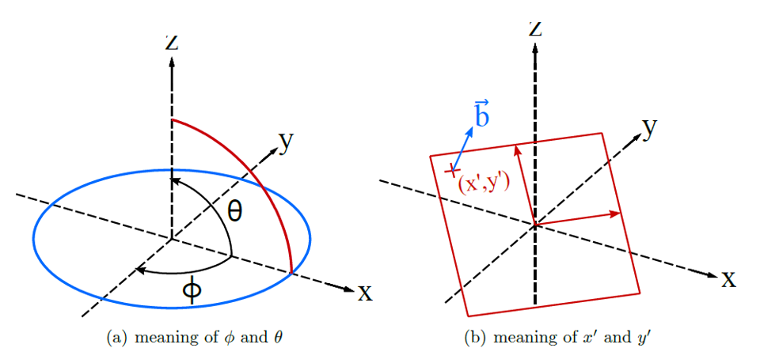
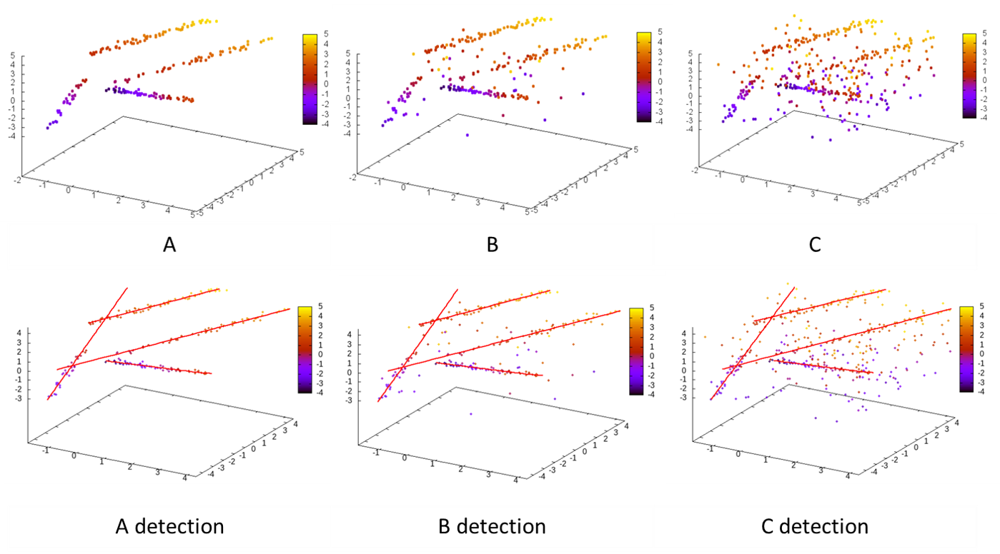
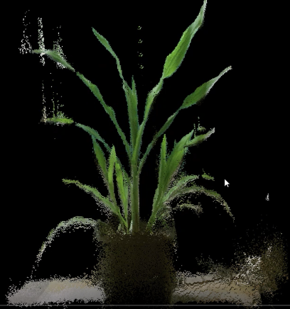
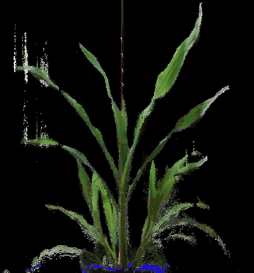

# The Hough Transform

--

- Transformation:

$$r = x \cos \theta + y \sin \theta$$

.center[
<!--  -->

]

- Nonconvex Optimization Problem

---

# Hough Transformation Steps

.center[
<!--  -->

]

---

# Hough Transformation Result

.center[

]

---

# Limitations

- How to deal with thick lines?
- How many lines do we want to detect?

---

# Detecting Roads

.center[

]

---

# Result

.center[

]

---

class: inverse, center, middle

# Linear Hough Transform Applied to Bullet Data

## Charlotte Roiger

---

# Motivation

.center[

]

---

# Motivation

.center[

]

---

# Motivation

.pull-left[

]

.pull-right[

]


Signatures curtesy of Heike Hofmann:https://heike.github.io/bulletxtrctr/
---

# Motivation

.center[

]

---

# Reduce to 2D

.center[

]

---

# Detect Grooves

.center[
]


---

# Normalized Scores
.center[
]


---

# Results: Successes

.center[

]


.center[

]


---

# Results: Failures

.center[

]

.center[

]

---
class: inverse, center, middle

# Circular Hough Transform

## Joe Zemmels

---

## Circular Hough Transform

- Detects center, $(x,y)$, of circle in an image given radius, $r$.
 - (Left) Image of circle to be detected. 
 - (Right) Accumulator array.

```{r, fig.cap="", out.width="100%", fig.keep="hold", fig.align='center',echo=FALSE}
knitr::include_graphics("images/Joe/houghTransformCircle.jpg")
```

---
### Application: Breech Face Impressions

.center[
<!--  -->

]

.pull-left[

]

.pull-right[

]

---

### Detecting Firing Pin Impression Circle

- Goal: Detect and filter out inner circle in the image
- Problem: Don't know radius ahead of time
 - Need to estimate radius before applying Hough Transform

.center[

]

---
<!-- ### Identifying Firing Pin Impression Radius -->
<!-- - Idea: Count non-NA pixels in each row of image.  -->
<!--   - Determine where this count hits local maxima. -->


<!--  -->
<!-- --- -->
### Identifying Firing Pin Impression Radius

- Test out a variety of radius values and choose the "best."
 - (Left) Hough Tranform-selected circles of radius $r \in \{191,...,231\}$. 
 - (Right) Accumulator arrays.

.pull-left[

]

.pull-right[

]

---
<!-- ### Hough Score Heuristic -->
<!-- - Identify consecutive radius values where Hough Score reaches consistently high values.  -->
<!--  - Take average of those radius values. -->

<!--  -->
<!-- --- -->


### Successes & Failures

.center[


]

---

class: inverse, center, middle

# 3D Hough Transform

## Lirong Xiang

---

# 3D line representation

-  Roberts' line representation: a 3D line can be represented by $x'$, $y'$  and vector b. 

```{r, out.width="95%", fig.keep="hold", fig.align='center',echo=FALSE}

```
---

-  comparison between 2D and 3D Hough Transform

```{r, out.width="100%", fig.keep="hold", fig.align='center',echo=FALSE}
knitr::include_graphics("images/Lirong/comparison.png")
```
---

-  3D Hough line detection

```{r, out.width="100%", fig.keep="hold", fig.align='center',echo=FALSE}

```

---

### Applications 

- Point cloud of a sorghum plant captured by Kinect v2

.pull-left[

]

.pull-right[

]

---

### Applications

- 3D Hough line and plane detection

.pull-left[

]

.pull-right[

]

---

### References

1. Google Maps
2. Wikipedia, "Hough Transform", "https://en.wikipedia.org/wiki/Hough_transform"
3. StackOverflow,
   "https://stackoverflow.com/questions/4709725/explain-hough-transformation"
